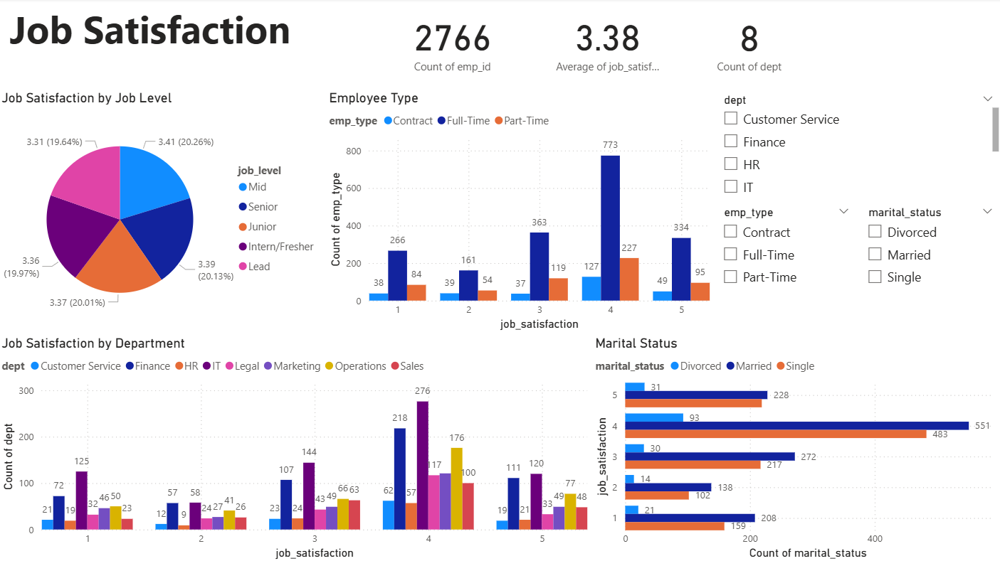
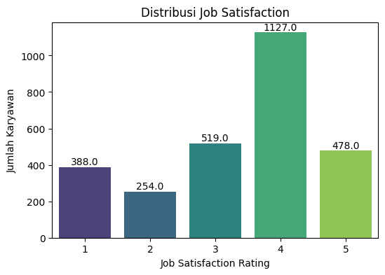
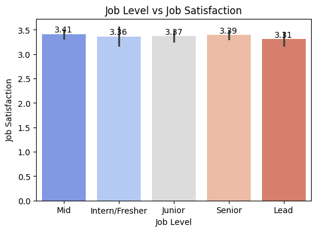
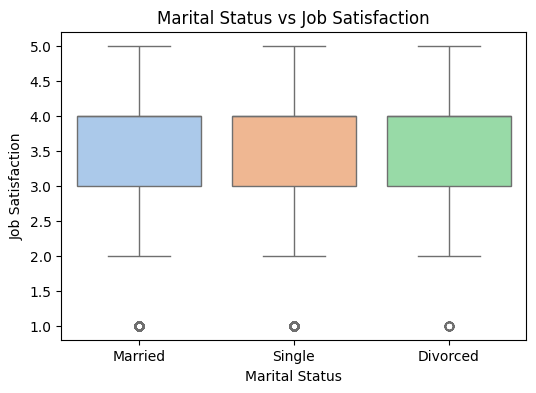
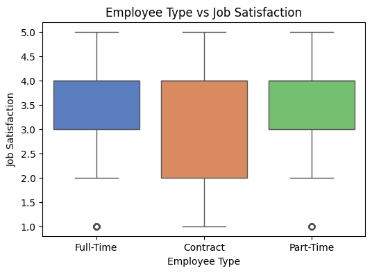

# 👥 People Analytics — Job Satisfaction Analysis

# 🎯 Objective
Menganalisis faktor-faktor yang memengaruhi Job Satisfaction karyawan.
Tujuan: memberikan insight strategis untuk meningkatkan kepuasan kerja, loyalitas, dan retensi karyawan

# 🗃️ Dataset
- Jumlah data: 2.766 baris × 23 kolom (survey karyawan).
- Hasil preprocessing:
  - ✅ Tidak ada missing values
  - ✅ Tidak ada duplikasi
  - ✅ Tidak ada outlier ekstrem
- Dataset dinyatakan bersih & siap dianalisis

# 🧩 Metodologi
- Eksplorasi distribusi Job Satisfaction (rating 1–5).
- Analisis perbedaan Job Satisfaction berdasarkan:
  - Department
  - Job Level
  - Marital Status
  - Employee Type
  - Visualisasi distribusi & perbandingan antar grup.
  - Insight & rekomendasi bisnis

# 🔑 Key Findings
- Distribusi Umum: Mayoritas memberi rating 4 (40.7%), cukup banyak yang memberi 5 (17.3%). Rating rendah (1–2) sekitar 23%.
- Department: IT (3.79) & Operations (3.76) paling tinggi, HR (3.40) & Finance (3.42) paling rendah.
- Job Level: Mid-level paling puas (3.41). Intern/Fresher (3.16) & Lead (3.11) lebih rendah.
- Marital Status: Married sedikit lebih tinggi dibanding Single/Divorced.
- Employee Type: Full-time lebih stabil; Contract & Part-time variasinya lebih lebar

# 📊 Visual

